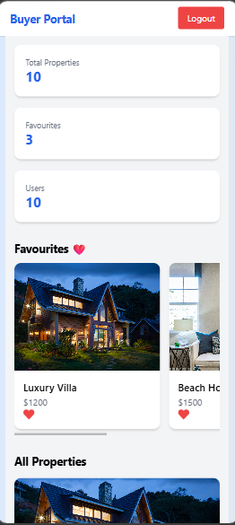
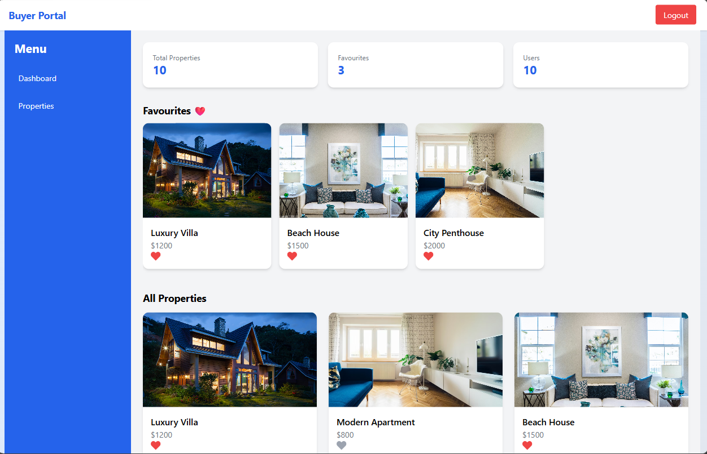

# BUYER PORTAL WEB APPLICATION

# 🏠 Real Estate Dashboard

A modern and responsive real estate dashboard built using React and Node.js.  
Users can browse properties, add favourites, and view them in a clean UI.

---

## 🚀 Features

- View all properties
- Add / remove favourites
- Dashboard stats (total properties, favourites, users)
- Fully responsive design (mobile + desktop)
- Sliding favourites section (carousel style)
- Authentication (Login / Register)
- Fast and clean UI using Tailwind CSS

---

## Tech Stack

### Frontend
- React.js
- Tailwind CSS
- Axios

### Backend
- Node.js
- Express.js

### Database
- MongoDB (Mongoose)

---

## Project Structure
- 
techcraft/
├── backend/
├── frontend/
├── package.json
├── package-lock.json
└── README.md

## How to Run or Install dependencies
# Frontend
    - cd frontend
    - npm install
    -npm start
# Backend
    - cd backend
    - npm install
    - node server.js

## API Endpoints
 - GET properties / favourite
 - POST favourite- add/remove

 ## Author
 **Prabhakar Khadka**
 
 ## Portfolio
 https://www.khadkaprabhakar.com.np

## GITHUB
https://github.com/kdkprabhakar100

## live website

## Mobile View

## Laptop view
